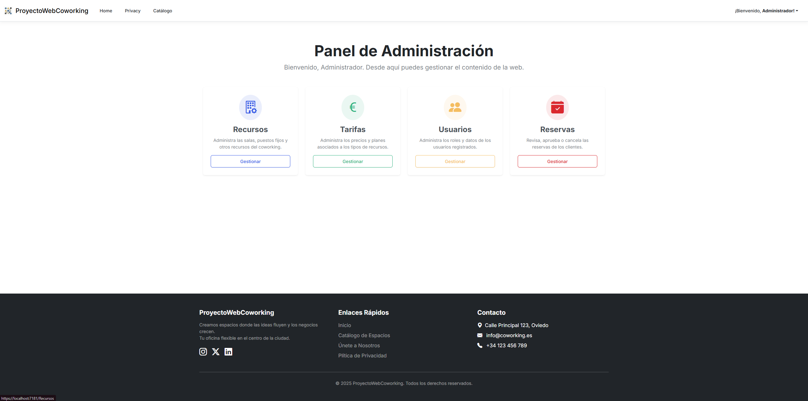
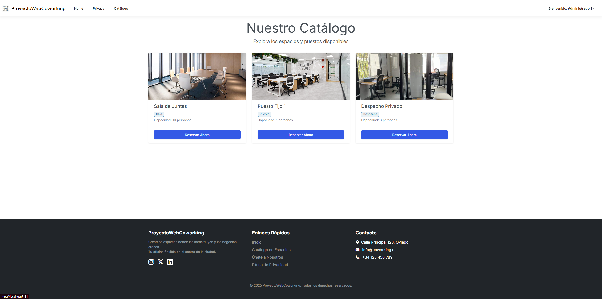

# 🏢 Sistema de Gestión de Coworking (ProyectoWebCoworking)

## 📋 Descripción
Proyecto de Fin de Ciclo (Desarrollo de Aplicaciones Web).
Es una aplicación web completa para la gestión integral de un espacio de Coworking. Permite a los usuarios reservar salas y puestos, y a los administradores gestionar recursos, tarifas y usuarios.

## 🚀 Tecnologías Utilizadas
* **Backend:** ASP.NET Core 8 (MVC)
* **Base de Datos:** MySQL & Entity Framework Core (Code First / Database First)
* **Frontend:** HTML5, CSS3, Bootstrap 5 (Tema Zephyr), JavaScript (jQuery)
* **Seguridad:** Autenticación por Cookies, Encriptación BCrypt, Roles (RBAC)
* **Herramientas:** Visual Studio 2022, MySQL Workbench.

## ✨ Funcionalidades Principales
* **Panel de Administración:** Gestión CRUD completa de recursos, tarifas y usuarios.
* **Reservas Inteligentes:** Validación automática de disponibilidad (prevención de overbooking).
* **Cálculo de Tarifas:** Cálculo dinámico de precios en tiempo real antes de confirmar.
* **Área de Cliente:** Historial de reservas y gestión de perfil.
* **Notificaciones:** Simulación de envío de correos de confirmación.

## 📸 Capturas de Pantalla
| Home Page | Panel Admin |
|-----------|-------------|
|  |  |

| Catálogo | Reservas |
|----------|----------|
|  |  |

## 🔧 Instalación y Despliegue
1.  Clonar el repositorio.
2.  Importar el script SQL ubicado en la carpeta `/Database` en MySQL Workbench.
3.  Configurar la cadena de conexión en `appsettings.json`.
4.  Ejecutar con Visual Studio (`F5`).

## 👤 Autor
David Suárez-Otero Redondo - [LinkedIn] https://www.linkedin.com/in/david-suarez-otero-redondo/
