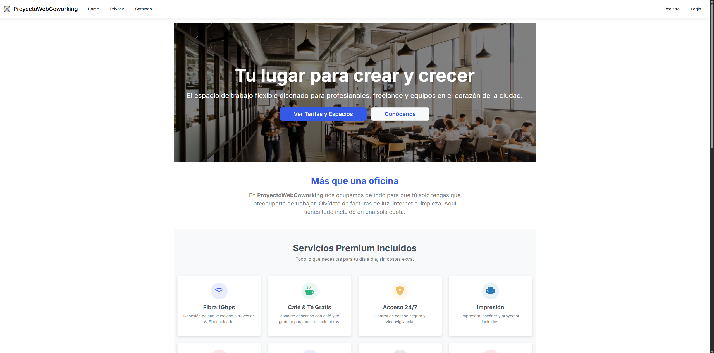
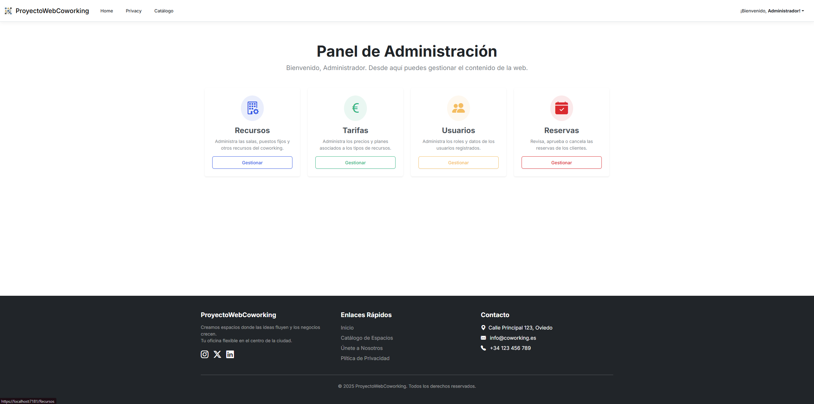
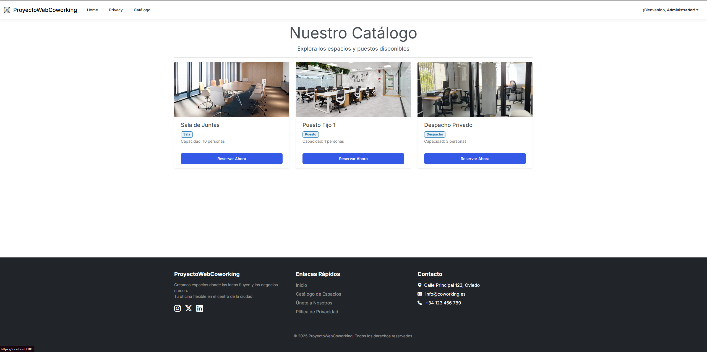
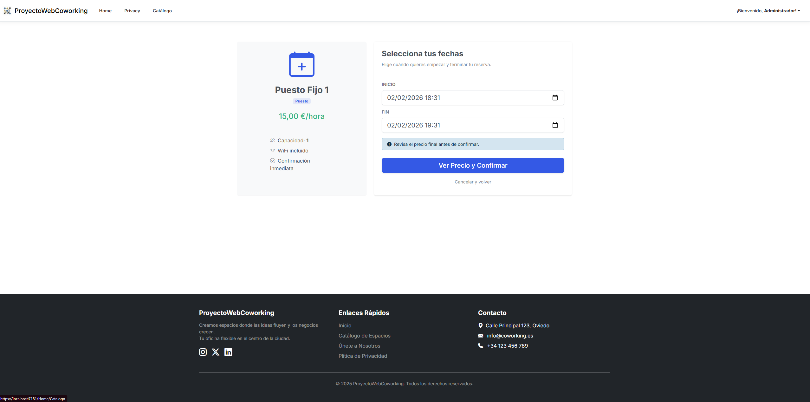

# 🏢 Coworking Manager (ProyectoWebCoworking)

Sistema de gestión integral para espacios de coworking: reservas de salas y puestos para usuarios, control total de recursos, tarifas y usuarios para administradores.


> 🚧 **Demo en preparación** — mientras se resuelve el hosting con MySQL, las capturas y las instrucciones de instalación permiten evaluar el proyecto en local.

## 📸 Capturas de pantalla

| Home Page | Panel Admin |
|-----------|-------------|
|  |  |

| Catálogo | Reservas |
|----------|----------|
|  |  |

## 📋 Problema que resuelve

Los espacios de coworking pequeños y medianos suelen gestionar reservas y disponibilidad con hojas de cálculo o mensajes, lo que genera solapes de reservas, errores de tarifa y cero trazabilidad. Coworking Manager centraliza reservas, disponibilidad y tarifas en un único sistema con roles diferenciados: los clientes reservan viendo disponibilidad real y precio calculado al momento; los administradores gestionan todo el catálogo desde su panel.

Proyecto de Fin de Ciclo (Desarrollo de Aplicaciones Web).

## ✨ Funcionalidades principales

* **Panel de administración:** gestión CRUD completa de recursos, tarifas y usuarios, protegida por rol.
* **Reservas con validación de disponibilidad:** comprobación de solapes de intervalos en el servidor antes de confirmar (prevención de overbooking).
* **Cálculo de tarifas:** precio calculado dinámicamente según el tipo de recurso y la duración, visible antes de confirmar.
* **Área de cliente:** historial de reservas y gestión de perfil.
* **Notificaciones por correo:** envío real de correos de confirmación de reserva vía SMTP (Gmail) a través de un servicio inyectado (`IEmailService`).

## 🚀 Tecnologías

| Capa | Tecnología |
|---|---|
| Backend | ASP.NET Core 8 (MVC), C# |
| ORM / Datos | Entity Framework Core 9 (proveedor Pomelo para MySQL), Code First / Database First |
| Base de datos | MySQL 8 |
| Frontend | Razor Views, HTML5, CSS3, Bootstrap 5 (tema Zephyr), JavaScript (jQuery) |
| Seguridad | Autenticación por cookies, hashing de contraseñas con BCrypt, control de acceso por roles (RBAC) |
| Herramientas | Visual Studio 2022, MySQL Workbench |

## 🏗️ Arquitectura

Aplicación MVC monolítica en capas. Los controladores concentran el flujo de cada dominio (reservas, recursos, tarifas, usuarios) y acceden a los datos a través del `DbContext` de EF Core; la capa `Services/` aísla la infraestructura de correo tras una interfaz (`IEmailService`) registrada por inyección de dependencias.

```
Navegador (Razor Views + Bootstrap 5 + jQuery)
        │
        ▼
Controllers (ASP.NET Core MVC)
  · [Authorize] + roles (RBAC) a nivel de controlador
  · validación de disponibilidad y cálculo de tarifas
        │                              │
        ▼                              ▼
EF Core DbContext              Services (IEmailService)
(Pomelo MySQL)                 → SMTP Gmail
        │
        ▼
MySQL (coworking_db)
```

* **Autenticación:** cookies (`CookieAuthenticationDefaults`) con expiración de sesión y rutas de login/acceso denegado configuradas en `Program.cs`.
* **Autorización:** RBAC aplicado con `[Authorize(Roles = "Administrador")]` en los controladores de administración — una URL directa no salta el control de permisos.
* **Modelo de datos:** entidades `Usuario`, `Recurso`, `Tarifa` y `Reserva` mapeadas en `coworking_dbContext`.

## 🔧 Instalación

Requisitos: [.NET 8 SDK](https://dotnet.microsoft.com/download/dotnet/8.0) y MySQL 8.

```bash
# Clonar el repositorio
git clone https://github.com/davidsored/ProyectoWebCoworking.git
cd ProyectoWebCoworking

# Crear la base de datos: importar en MySQL Workbench el script
#   "Script base de datos/script_base_datos.sql"

# Configurar la cadena de conexión (ver sección Configuración)

# Ejecutar
cd ProyectoWebCoworking
dotnet run
```

También puede abrirse la solución `ProyectoWebCoworking.sln` en Visual Studio 2022 y ejecutar con `F5`.

## ⚙️ Configuración

La aplicación lee su configuración del sistema estándar de ASP.NET Core. `appsettings.json` define la estructura de claves con los valores sensibles **vacíos a propósito** — las credenciales reales nunca se escriben en el repositorio:

* `ConnectionStrings:DefaultConnection` — cadena de conexión a MySQL (servidor, puerto, base de datos `coworking_db`, credenciales).
* `EmailSettings` — remitente, contraseña de aplicación, host y puerto SMTP para los correos de confirmación.

En desarrollo, rellenar los valores con [user secrets](https://learn.microsoft.com/aspnet/core/security/app-secrets) (el proyecto ya tiene `UserSecretsId` configurado):

```bash
cd ProyectoWebCoworking
dotnet user-secrets set "ConnectionStrings:DefaultConnection" "Server=127.0.0.1;Port=3306;Database=coworking_db;User=...;Password=..."
dotnet user-secrets set "EmailSettings:PasswordAplicacion" "..."
```

En producción, definir las variables de entorno equivalentes (el host de ASP.NET Core las mapea automáticamente):

```bash
ConnectionStrings__DefaultConnection="Server=...;Database=coworking_db;User=...;Password=..."
EmailSettings__PasswordAplicacion="..."
```

## 💡 Decisiones técnicas relevantes

* **Contraseñas con BCrypt** en lugar de hashing simple: decisión explícita de seguridad, no un requisito del curso.
* **RBAC aplicado en el controlador**, no solo ocultando botones en la vista: el atributo `[Authorize(Roles = ...)]` protege cada acción aunque se acceda por URL directa.
* **EF Core en dos modos (Code First / Database First)** para poder partir de un esquema MySQL ya existente, como ocurre en entornos reales, y no solo generar la base desde cero.
* **Correo tras una interfaz (`IEmailService`)** registrada en el contenedor de dependencias: la implementación SMTP de Gmail es intercambiable sin tocar los controladores.

## 📚 Aprendizajes

Diseñar un modelo de disponibilidad y solapes es más delicado de lo que parece a priori (bordes de intervalos, reservas que se solapan parcialmente); fue el primer sitio donde entendí por qué la validación de negocio no puede vivir solo en el frontend.

## 🗺️ Roadmap

- [ ] Desplegar una demo pública (pendiente de resolver hosting con MySQL).
- [x] Externalizar la configuración sensible de `appsettings.json` a user secrets / variables de entorno.
- [ ] Extraer la lógica de negocio de los controladores a una capa de servicios dedicada.
- [ ] Añadir tests automatizados de la lógica de reservas (solapes y cálculo de tarifas).

## 📄 Licencia

MIT — ver [LICENSE](./LICENSE).

---

Proyecto de [David Suárez-Otero Redondo](https://github.com/davidsored) · [LinkedIn](https://www.linkedin.com/in/david-suarez-otero-redondo/)
